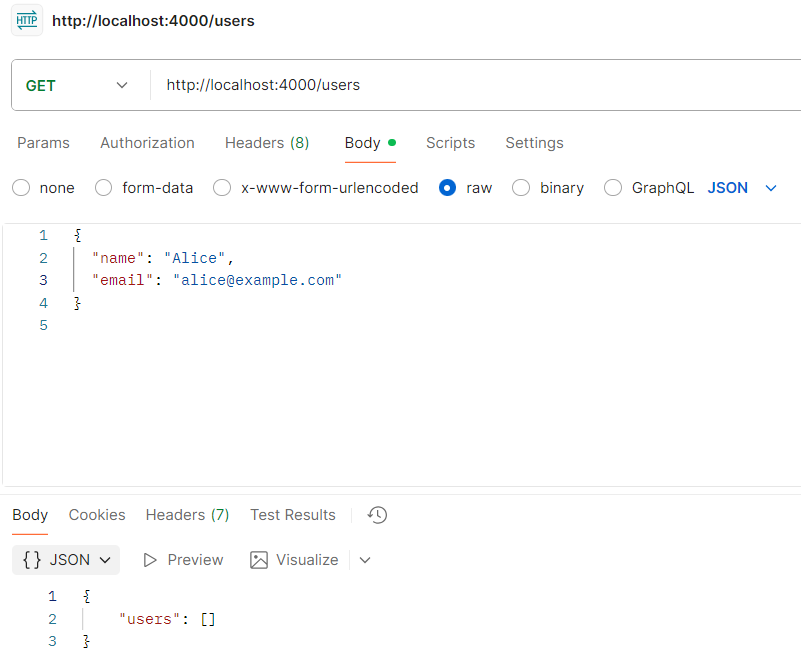
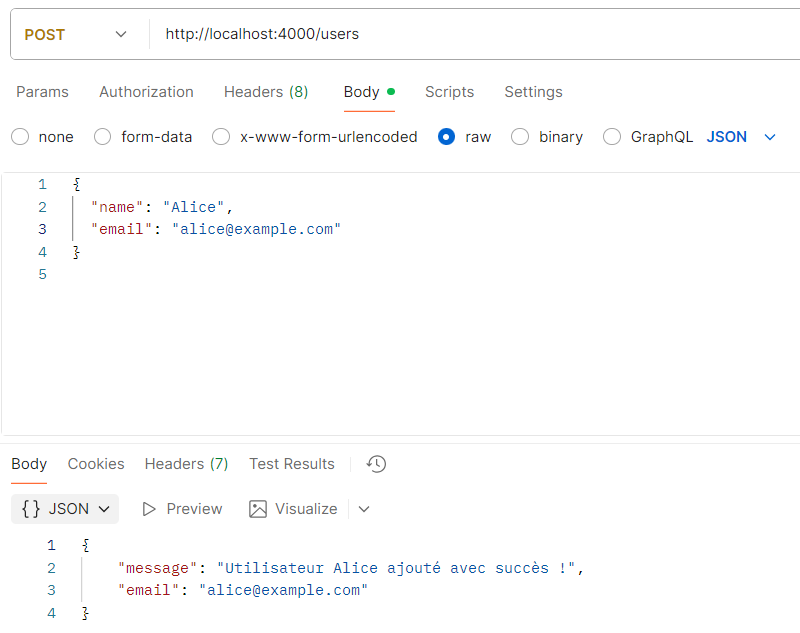
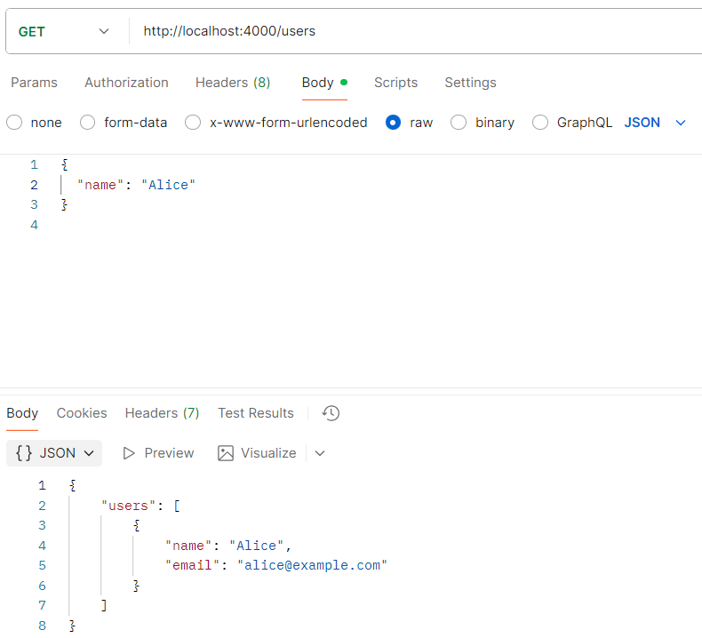

# API node.js

Ce projet est une API développée avec **Express** et **TypeScript**. 
Elle permet de gérer une liste d'utilisateurs avec des routes `GET` et `POST`. 
Les données sont stockées **en mémoire** (pas de base de données).

## Installation

Cloner le dépôt :

```bash
git clone https://github.com/Natacha62/TD_API.git
cd api-node-ts
```

Initialisation du projet Node.js :

```bash
npm init -y
```

Installation des dépendances :

```bash
npm install express dotenv
npm install -D typescript ts-node @types/node @types/express nodemon
```

Initialisation de TypeScript :

```bash
npx tsc --init
```
## Utilisation

Lancer le serveur :

```bash
npm run dev
```

Le serveur démarre sur : http://localhost:4000

## Description des routes

### GET /users

- **Objectif** : Récupérer la liste des utilisateurs.
- **Méthode** : GET
- **URL** : http://localhost:4000/users

### POST /users

- **Objectif** : Ajouter un nouvel utilisateur.
- **Méthode** : POST
- **URL** : http://localhost:4000/users

## Test et démonstration

### Postman

#### 1. GET /users (avant ajout)


#### 2. POST /users


#### 3. GET /users (après ajout)
